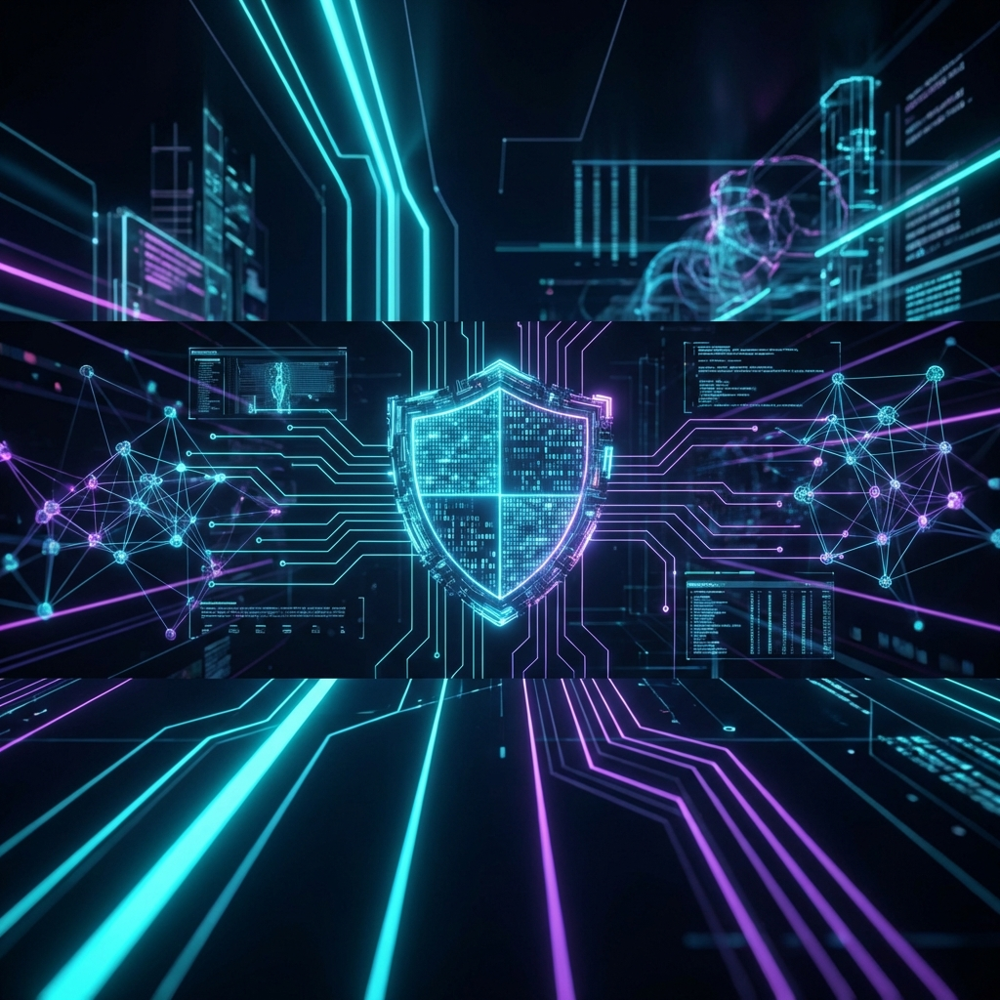

<div align="center">



# 🛡️ Arishadvarga Guardian
### **Next-Gen AI-Powered Cybersecurity Platform for CyberSafe Campus**

[](https://www.amd.com/)
[]()
[](LICENSE)
[](https://ai.google.dev/)
[]()

---

**Arishadvarga Guardian** is a comprehensive, AI-assisted cybersecurity ecosystem designed to protect, educate, and empower campus communities. Submitted for the **AMD Slingshot** competition, it leverages advanced AI and real-time monitoring to defend against modern digital threats.

</div>

---

## 👥 Meet Team #include S3Pings
We are a dedicated group of students from **CMRCET (Malla Reddy College of Engineering and Technology)**, committed to building safer digital environments.

| Role | Name | Campus |
|------|------|--------|
| **Team Lead / Dev** | [Krishna Koushik](https://github.com/krishnakoushik9) | CMRCET |
| **Security Analyst** | KavyaSri | CMRCET |
| **UI/UX & Research** | Aishwarya | CMRCET |

---

## 🚀 Key Modules & Features

### 🎯 **1. Phishing Lab**
Interactive laboratory for simulating and detecting social engineering attacks.
- **AI Phishing Detection**: Uses Gemini to analyze emails and messages for malicious intent.
- **URL Analysis**: Real-time scanning for typosquatting and deceptive domains.
- **Confidence Scoring**: Get an AI-driven probability score for potential phishing attempts.

### 🧴 **2. Digital Hygiene**
A personal safety dashboard for students to maintain their digital "cleanliness".
- **Privacy Score**: Evaluates account privacy settings across various platforms.
- **Data Leakage Check**: Scans for compromised credentials and leaked personal data.
- **Device Security**: Real-time health checks for local system security posture.

### 🎓 **3. Learning Hub**
Gamified educational platform designed to build a culture of security.
- **Cybersecurity Courses**: Interactive lessons on threat response and digital safety.
- **Progress Tracking**: Track learning milestones with a dedicated dashboard.
- **AI Explainer**: Uses GenAI to break down complex security concepts into simple terms.

### 🕹️ **4. Control Room (Network Visualization)**
A high-tech command center for real-time threat hunting.
- **D3.js Network Graph**: Interactive, force-directed graph of all active connections.
- **Live Process Monitor**: Track and terminate suspicious system processes.
- **IP Enrichment**: Instant threat intelligence on every connected IP address.

### 📁 **5. File Safety & Malware Analysis**
Deep inspection of files for malicious content.
- **ClamAV Integration**: Scans uploads and system files for known malware signatures.
- **AI Behavior Analysis**: Predicts file intent using Gemini AI logic.
- **MITRE ATT&CK Mapping**: Automatically maps detected threats to professional security frameworks.

---

## 🤖 AI-Powered Capabilities (Powered by Gemini)

The "Guardian" is enhanced by state-of-the-art Generative AI to provide:
- **Log Summarization**: Transforms cryptic system logs into plain-English incident reports.
- **Threat Attribution**: Identifies potential threat actors based on behavioral patterns.
- **Automated Incident Response**: Suggests the best course of action during an active breach.
- **ID Verification**: Vision-powered verification for accessing sensitive offensive tools.

---

## 🛠️ Technology Stack

| Layer | Technology |
|-------|------------|
| **Core Framework** | Next.js 16 (App Router), React 19, TypeScript |
| **Desktop Shell** | Electron 40 |
| **AI Engine** | Google Gemini API (gemini-2.0-flash) |
| **Visualization** | D3.js, Recharts |
| **Backend Logic** | Node.js, SSH2, ClamAV |
| **UI/UX** | CSS Modules, Lucide React, Framer Motion |

---

## 📦 Installation & Setup

### Prerequisites
- Node.js 18+
- npm or yarn
- Gemini API Key (stored in `.env`)

### Quick Start
```bash
# Clone the repository
git clone https://github.com/krishnakoushik9/Team-inlude-S3Pings.git

# Install dependencies
npm install

# Setup environment
cp .env.example .env
# Edit .env and add: GEMINI_API_KEY=your_key_here

# Run Web Version
npm run dev

# Run Desktop App (Electron)
npm run electron:dev
```

---

## 👤 Credits & Ownership

<div align="center">

**Arishadvarga Guardian** is the intellectual property of **Team #include S3Pings**.
Built with passion for **AMD Slingshot**.

[**Krishna Koushik**](https://github.com/krishnakoushik9) | [**KavyaSri**] | [**Aishwarya**]

---

[](https://github.com/krishnakoushik9/Team-inlude-S3Pings)

</div>
